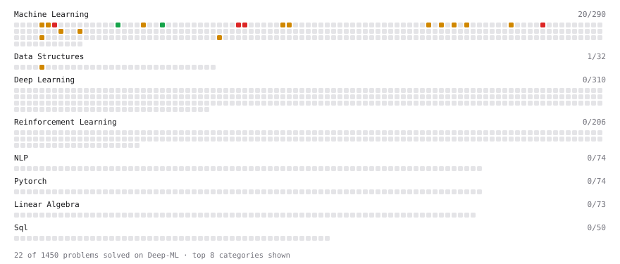

# Deep-ML

My machine learning practice from [Deep-ML](https://www.deep-ml.com). Every solution here was written by hand.

**2** solved · 2 problems · 0 labs · 0 math

[**Browse the interactive portfolio**](https://lamhaourii.github.io/deep-ml/) to replay this filling in over time.

## Problems

| | Difficulty | Solved | |
| --- | --- | --- | --- |
| [Implement Ridge Regression Loss Function](https://www.deep-ml.com/problems/43) | easy | 2026-09-16 | [solution](problems/0043-implement-ridge-regression-loss-function) |
| [Implement Lasso Regression using ISTA](https://www.deep-ml.com/problems/50) | medium | 2026-09-16 | [solution](problems/0050-implement-lasso-regression-using-ista) |

---

_This file is regenerated by Deep-ML on every push._
